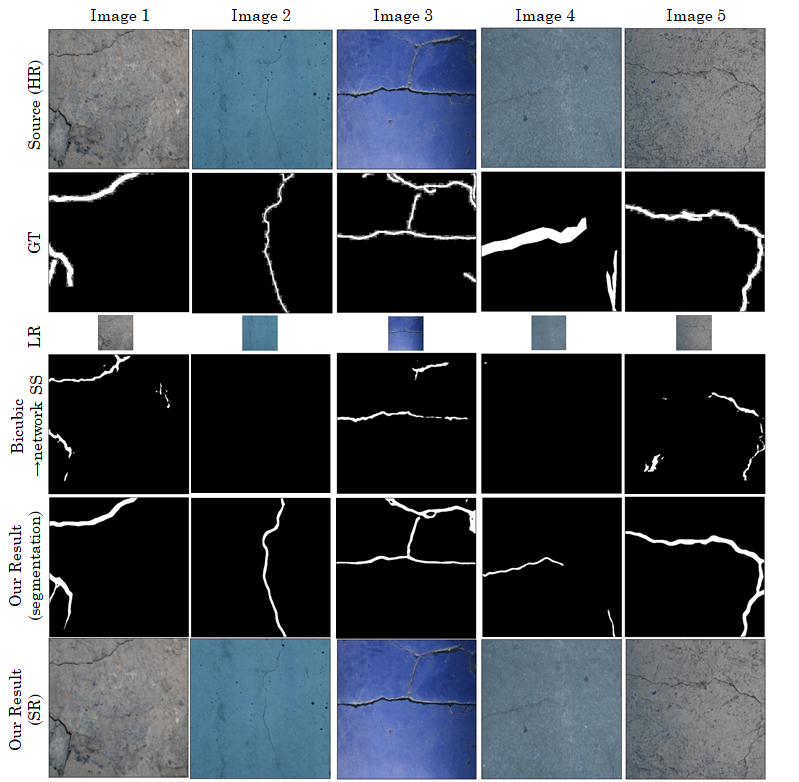
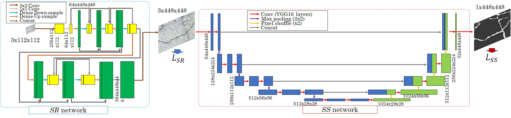

# Crack Segmentation for Low-Resolution Images using Joint Learning with Super-Resolution (CSSR)
### [Paper](http://www.mva-org.jp/Proceedings/2021/papers/O1-1-2.pdf) | [Data](https://drive.google.com/drive/folders/1b8E0XjgdstW3tvKdGFAXA4utktgeguNX?usp=sharing)
<!-- [<br> -->
<br>

[Crack Segmentation for Low-Resolution Images using Joint Learning with Super-Resolution](http://www.mva-org.jp/Proceedings/2021/papers/O1-1-2.pdf)<br>
 [Yuki Kondo](https://yuki-11.github.io/)\*<sup>1</sup>,
 [Norimichi Ukita](https://www.toyota-ti.ac.jp/Lab/Denshi/iim/ukita/index-j.html)\*<sup>1</sup><br>
 \*<sup>1</sup>[Toyota Technological Institute (TTI-J)](https://www.toyota-ti.ac.jp/english/) <br>
in [MVA 2021](http://www.mva-org.jp/mva2021/) (Oral Presentation, [Best Practical Paper Award](http://www.mva-org.jp/archives.BestPracticalPaperAward.php))



## Our Framework


## News
* July 27, 2021 -> We received the [Best Practical Paper Award](http://www.mva-org.jp/archives.BestPracticalPaperAward.php) at [MVA 2021](http://www.mva-org.jp/mva2021/)

## What's this?

We have proposed a method for high-resolution crack segmentation for low-resolution images. This approach enables automatic detection of cracks even when the image resolution of the crack area is reduced due to an environment in which the area where defects may occur must be photographed from a distance (e.g., An environment in which a drone that targets a high-altitude chimney wall must take a distance in order to fly safely.). The proposed method is composed of the following two approaches.

1. Deep learning based super resolution to increase the resolution of low-resolution images. Segmentation of this super-resolution image enables defect detection. In addition, we proposed **CSSR (Crack Segmentation with Super Resolution)** using end-to-end joint learning to **optimize the super-resolution for the crack segmentation process**.

2. In order to optimize the deep learning model for defect segmentation, we proposed a loss function **Boundary Combo loss** that simultaneously optimizes the global and local structures of cracks. This loss function enables both detection of thin and difficult-to-detect cracks and detection of fine crack boundaries.

**The experimental results show that the proposed method is superior to the conventional method, and quantitatively\*<sup>1</sup> and qualitatively, the segmentation is as precise as when using high-resolution images.**

 \*<sup>1</sup>; In terms of IoU, the proposed method achieves **97.3% of the IoU of the high-resolution image input**.

## Dependencies
* Python >= 3.6
* PyTorch >= 1.8
* numpy >= 1.19


## Usage

1. Clone the repository:

   ```shell
   git clone https://github.com/Yuki-11/CSSR.git
   ```

2. Download [khanhha dataset](https://github.com/khanhha/crack_segmentation):

   ```shell
   cd $CSSR_ROOT
   mkdir datasets
   cd datasets
   curl -sc /tmp/cookie "https://drive.google.com/uc?export=download&id=1xrOqv0-3uMHjZyEUrerOYiYXW_E8SUMP" > /dev/null
   CODE="$(awk '/_warning_/ {print $NF}' /tmp/cookie)"  
   curl -Lb /tmp/cookie "https://drive.google.com/uc?export=download&confirm=${CODE}&id=1xrOqv0-3uMHjZyEUrerOYiYXW_E8SUMP" -o temp_dataset.zip
   unzip temp_dataset.zip
   rm temp_dataset.zip
   ```

3. Download trained models:

   ```shell
   cd $CSSR_ROOT
   mkdir output
   ```
   You can download trained models [here](https://drive.google.com/drive/folders/17yCHnmpJtxkog010ttFg2U2r8oBBoGlD?usp=sharing). Then, place the unzipped directory of the models you want to use under <$CSSR_ROOT/output/>.

3. Install packages:

   ```shell
   cd $CSSR_ROOT
   pip install -r requirement.txt
   ```

4. Training:
   ```shell
   cd $CSSR_ROOT
   python train.py --config_file <CONFIG FILE>
   ```
   
   If you want to resume learning, you can do it with the following command.
   ```shell
   cd $CSSR_ROOT
   python train.py --config_file output/<OUTPUT DIRECTORY (OUTPUT_DIR at config.yaml)>/config.yaml --resume_iter <
Saved iteration number>
   ```

5. Test:
   ```shell
   cd $CSSR_ROOT
   python test.py output/<OUTPUT DIRECTORY (OUTPUT_DIR at config.yaml)> <iteration number> 
   ```

## Citations
If you find this work useful, please consider citing it.
```
@inproceedings{CSSR2021,
  title={Crack Segmentation for Low-Resolution Images using Joint Learning with Super-Resolution},
  author={Kondo, Yuki and Ukita, Norimichi},
  booktitle={International Conference on Machine Vision Applications (MVA)},
  year={2021}
}

```
